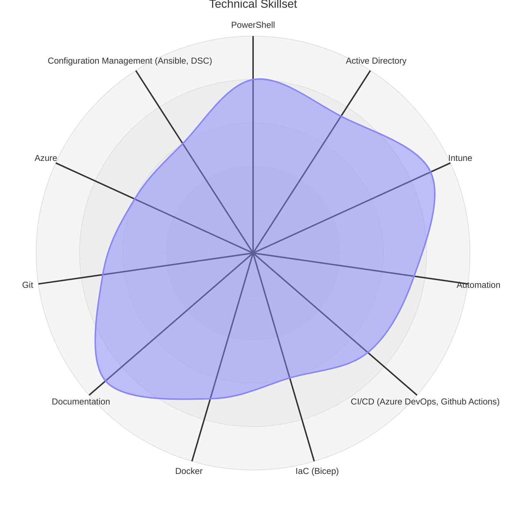
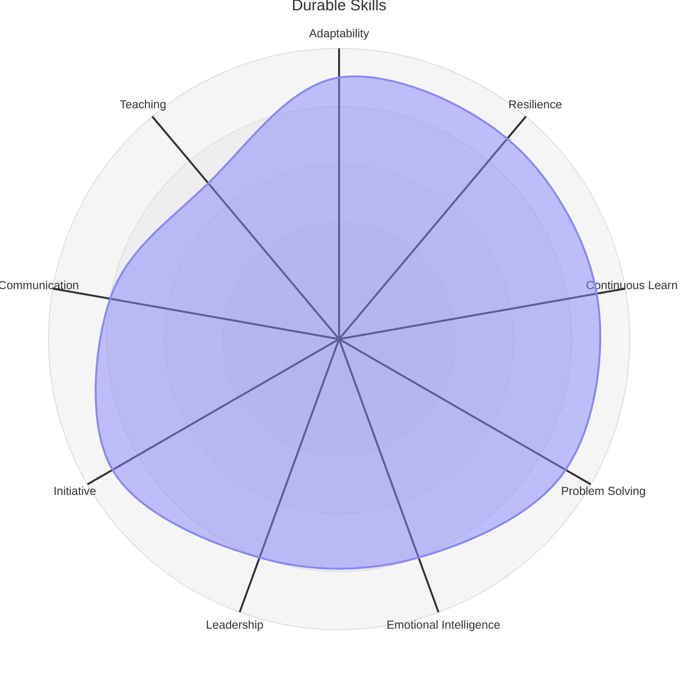

```mermaid
---
title: "Technical Skillset"
---
radar-beta
  showLegend false
  axis ps["PowerShell"], ad["Active Directory"], int["Intune"]
  axis az["Automation"], cicd["CI/CD (Azure DevOps, Github Actions)"], IaC["IaC (Bicep)"]
  axis dock["Docker"], doc["Documentation"], git["Git"], azu["Azure"]
  axis Config["Configuration Management (Ansible, DSC)"]
  curve adrian["Adrian"]{8, 7.5, 9, 7.5, 7, 6, 7, 9, 7, 6, 6}

  max 10
  min 0
    graticule circle
  ticks 5

```

```mermaid
---
title: "Durable Skills"
---
radar-beta
  showLegend false
  axis ada["Adaptability"], res["Resilience"], cli["Continuous Learning"]
  axis prob["Problem Solving"], emo["Emotional Intelligence"], lead["Leadership"]
  axis init["Initiative"], comm["Communication"], teach["Teaching"]
  curve adrian["Adrian"]{9, 9, 9, 9, 8, 8, 9, 8, 7}

  max 10
  min 0

```